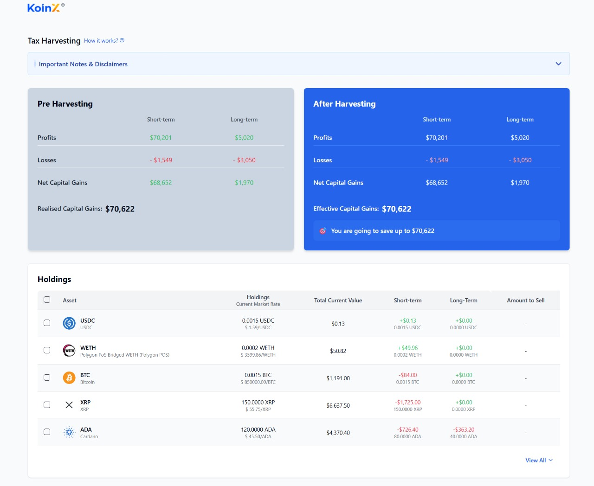

# Tax Loss Harvesting - KoinX Assignment



## Project Overview

This project implements a Tax Loss Harvesting tool that allows users to simulate how selling certain assets would impact their capital gains tax liability. Users can select assets they're considering selling and instantly see the effect on their short-term and long-term capital gains.

## Technologies Used

- **React** - Frontend UI library  
- **TypeScript** - Type-safe JavaScript  
- **Vite** - Build tool and development server  
- **Tailwind CSS** - Utility-first CSS framework  
- **shadcn/ui** - UI component library  
- **Recharts** - Charting library for visualization  
- **Lucide React** - Icon library for clean UI elements  
- **React Query** - Data fetching and state management  

## Setup Instructions

### Prerequisites
- Node.js (v16 or newer)
- npm or yarn package manager

### Installation

1. Clone the repository:
   ```sh
 https://github.com/tanishka098/assignments-by-KoinX.git
